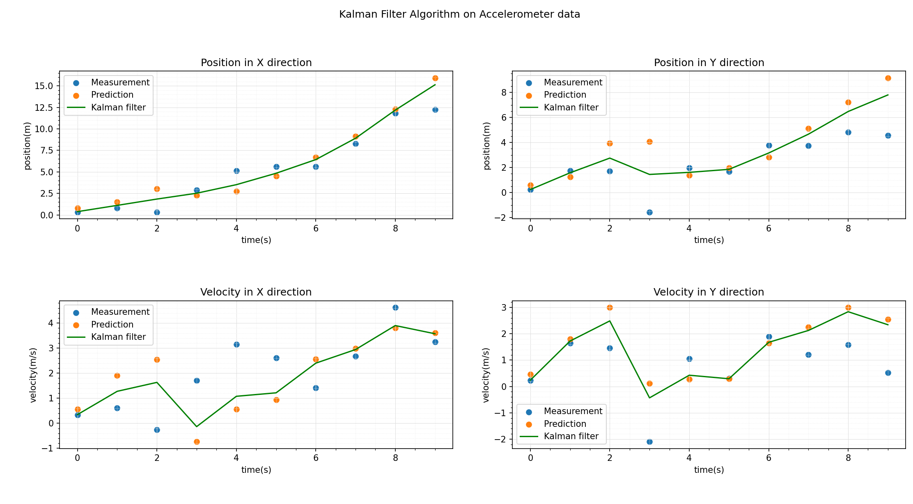

# Kalman Filter Simulator  

## Project Overview
The Kalman Filter Simulator was aimed to enhance the accuracy of the accelerometer (Position Sensor) data, since all sensors have measurement errors that make unprocessed data unreliable.

Through the application of Kalman filter algorithm on the sensor data the python based simulator effectively predicts and corrects the errors, enhancing the reliability of the data set.

The sensor data was modelled based on simple Netwonian physics formulae along with predefined uncertainties and noise characteristics. 

The end result of this project was comparison graphs illustrating the difference between the sensor data before and after the application of the Kalman Filter Algorithm, demonstrating the effectiveness of the algorithm. Overall, the implementation of the Kalman filter enhanced the accuracy of the sensor data.

This project is divided into two phases:
- Phase 1: Translation lecture examples into functional code
- Phase 2: Familiarization with the use of FilterPy library

## Deliverables
Graphical representation of Kalman filter algorithm.

## Project Timeline
Phase 1️⃣:  week 2 of October 2023 to week 3 of November 2023   
Phase 2️⃣:  week 3 of November 2023 to March 2024

## Results
### Phase 1

### Phase 2
In progress....

## 📑 References

[Michel Van Biezen - Lectures](https://www.youtube.com/watch?v=CaCcOwJPytQ&list=PLX2gX-ftPVXU3oUFNATxGXY90AULiqnWT&index=1)            
[Understanding Kalman Filter with python - James Teow - May 2018](https://medium.com/@jaems33/understanding-kalman-filters-with-python-2310e87b8f48)     
[Introduction to Kalman Filter - University of North Carolina - Greg et Bishop - 2001](https://courses.cs.washington.edu/courses/cse571/03wi/notes/welch-bishop-tutorial.pdf)    
[Kalman Filters: A step by step implementation guide in python - Garima Nishad - March 2019](https://medium.com/analytics-vidhya/kalman-filters-a-step-by-step-implementation-guide-in-python-91e7e123b968)    
[Basic writing and formatting syntax - Github](https://docs.github.com/en/get-started/writing-on-github/getting-started-with-writing-and-formatting-on-github/basic-writing-and-formatting-syntax)   

