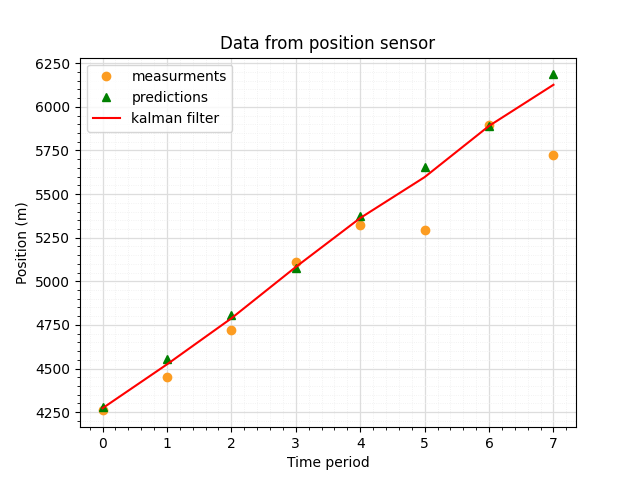
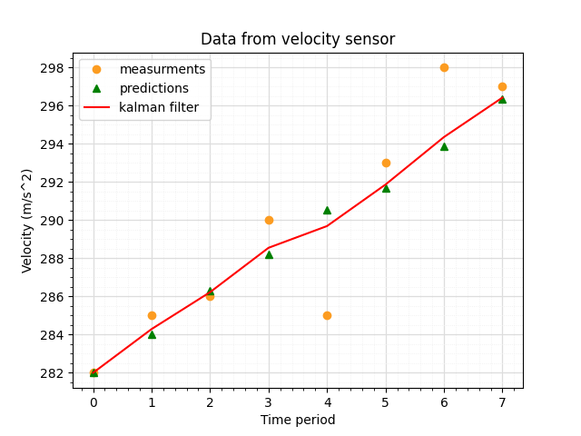

# Kalman Filter Algorithm  

## Project Overview
This project is designed for the purpose of learning the mathematics, coding and implementation of Kalman filter algorithm.

Kalman filter is a commonly used state estimation algorithm for data from electronic sensors. 

It predicts the sensor value based on the past, current readings and gives a wieght(trust factor) between the measurement and prediction.

This project is divided into two phases:
- Phase 1: Translation lecture examples into functional code
- Phase 2: Familiarization with the use of FilterPy library

## Deliverables
Graphical representation of Kalman filter algorithm.

## Project Timeline
Phase 1️⃣:  week 2 of October 2023 to week 3 of November 2023   
Phase 2️⃣:  week 3 of November 2023 to Present

## Results

## 📑 References

[Michel Van Biezen - Lectures](https://www.youtube.com/watch?v=CaCcOwJPytQ&list=PLX2gX-ftPVXU3oUFNATxGXY90AULiqnWT&index=1)            
[Understanding Kalman Filter with python - James Teow - May 2018](https://medium.com/@jaems33/understanding-kalman-filters-with-python-2310e87b8f48)     
[Introduction to Kalman Filter - University of North Carolina - Greg et Bishop - 2001](https://courses.cs.washington.edu/courses/cse571/03wi/notes/welch-bishop-tutorial.pdf)    
[Kalman Filters: A step by step implementation guide in python - Garima Nishad - March 2019](https://medium.com/analytics-vidhya/kalman-filters-a-step-by-step-implementation-guide-in-python-91e7e123b968)    
[Basic writing and formatting syntax - Github](https://docs.github.com/en/get-started/writing-on-github/getting-started-with-writing-and-formatting-on-github/basic-writing-and-formatting-syntax)   

