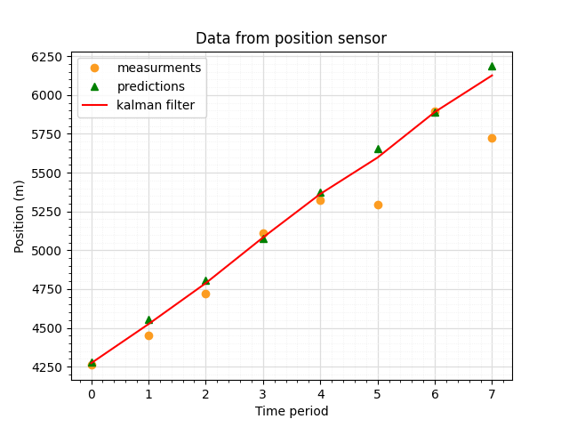
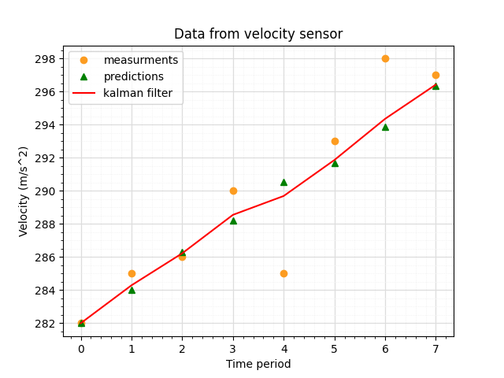

# Kalman-Filter

This repository is for learning about Kalman filters.

The plan is to solve few real world examples like temperature sensors, airplane velocity and position examples.

There would be multiple scripts that perform basic mathematical computations such as the gaussian distribution, it would be the form of small and reusable functions. These functions would be called in a main script where the actual simpplified version of the code would run.

## Deliverables
Graphical representation of Kalman filter.

## Project Timeline
Start date: 10 October 2023  
End Date: 31 December 2023

## Results

## 📑 References

[Michel Van Biezen - Lectures](https://www.youtube.com/watch?v=CaCcOwJPytQ&list=PLX2gX-ftPVXU3oUFNATxGXY90AULiqnWT&index=1)            
[Understanding Kalman Filter with python - James Teow - May 2018](https://medium.com/@jaems33/understanding-kalman-filters-with-python-2310e87b8f48)     
[Introduction to Kalman Filter - University of North Carolina - Greg et Bishop - 2001](https://courses.cs.washington.edu/courses/cse571/03wi/notes/welch-bishop-tutorial.pdf)    
[Kalman Filters: A step by step implementation guide in python - Garima Nishad - March 2019](https://medium.com/analytics-vidhya/kalman-filters-a-step-by-step-implementation-guide-in-python-91e7e123b968)    
[Basic writing and formatting syntax - Github](https://docs.github.com/en/get-started/writing-on-github/getting-started-with-writing-and-formatting-on-github/basic-writing-and-formatting-syntax)   

